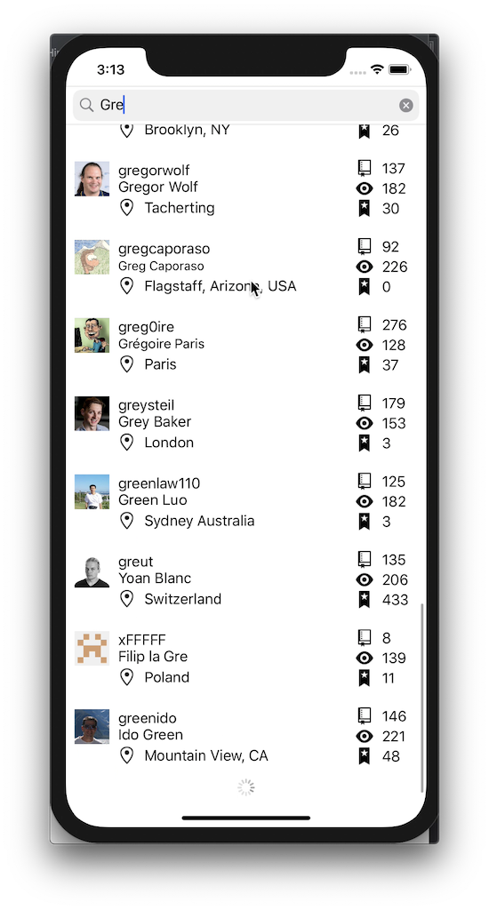

# GithubUsersMVVM
This project demonstrates Protocol-Oriented Programming (POP), the UI architectural MVVM pattern with bindings with ReactiveSwift in Swift 5.

## Features 
- It provides an input UI to enter keywords to search users from [Github search API](https://developer.github.com/v3/search/#search-users)
- It displays the search results with *UICollectionView*
- Github account name and avatar are mandatory for display
- Batch load search results with [Pagination](https://developer.github.com/v3/guides/traversing-with-pagination/): automatically load the next page 
- [Pagination](https://developer.github.com/v3/guides/traversing-with-pagination/) should be implemented by parsing link header of the reponse of Search Users API
- JSON parsing with *Codable* in Swift
- Support iOS 11.0 and later versions

## Memory Management 
- Used value types for data models
- Used weak and unowned references in closures properly
- Managed loosely-coupled dependencies with the Dependency Injection (DI) container pattern instead of the Singleton pattern. The relationships between Singletons and codes that depends on them are usually not well defined. Managing their lifecycles can be tricky.

## Concurrency 
- Used Grand Central Dispatch (GCD) to dispatch UI updates onto the main queue, since UIKit cannot be used from a background queue
- Used Alamofire for Networking services. Will demo it in another project. 

## SOLID Principles 
- Single Responsibility Principle: 1) used MVVM pattern to separate the busniess logics and the view/view controller and resolve the controller-view tightly-coupled problem in the architecture MVC pattern. 2) used Dependency Injection to separate the responsibility of dependent object creation from the instance.
- Open Closed Principle: used Interfaces (Protocol in Swift) to make structs/classes open for extension, but closed for modification.
- Liskov Subsitution Principle: created an abstract UICollectionViewCell `SearchUserBaseCell` and subclass from it to have 3 differenct sub-cells. Everywhere `SearchUserBaseCell` is using, I can use either of 3 sub-cells instead without breaking the app. 
- Interface Segregation Principle: split interfaces per Github service API instead of one general purpose interface
- Dependency Inversion Principle: used Inversion of Control (IoC) pattern to represent Dependency Inversion decoupling dependencies between high-level and low-level layers with Dependency Injection (DI) which depends on Interfaces (Protocol in Swift). All dependencies are given from outside to decouple the usage of an object from its creation. This also brings a benefit of testability. Implemented DI with the DI container pattern.

## Testing 
- Unit tests: tested view models with service mocks and data stubs (code coverage of view models: over 90%)

## 3rd Party Resources 
- Icons: https://octicons.github.com
- CocoaPods

## License 
[MIT](https://github.com/primer/octicons/blob/master/LICENSE)
